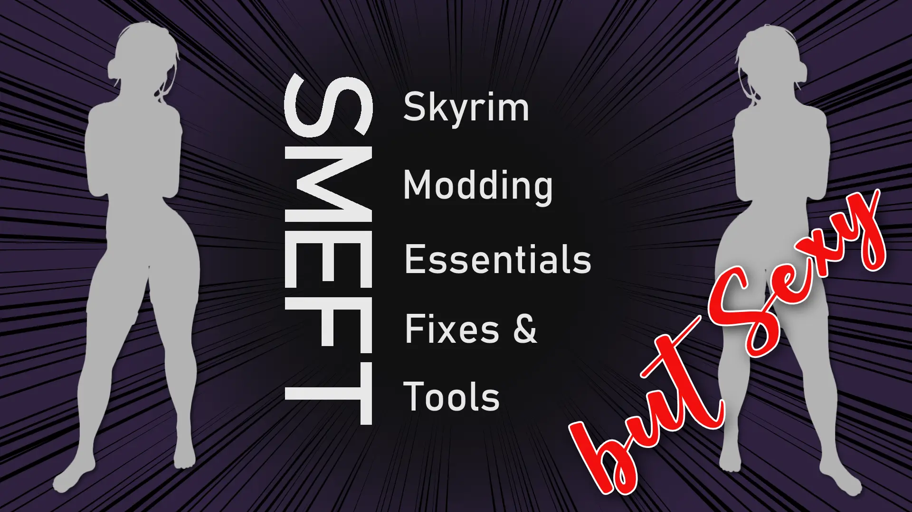
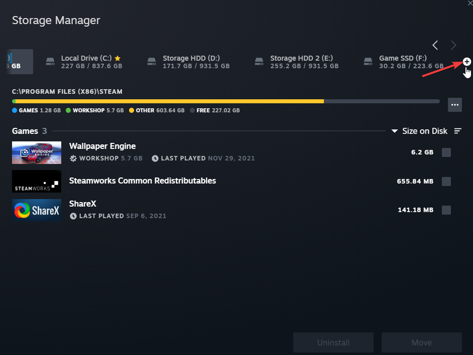
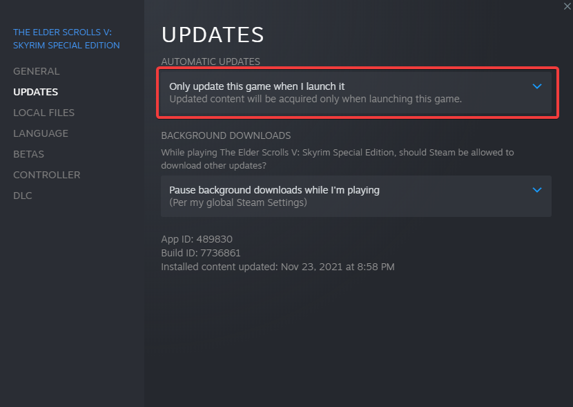
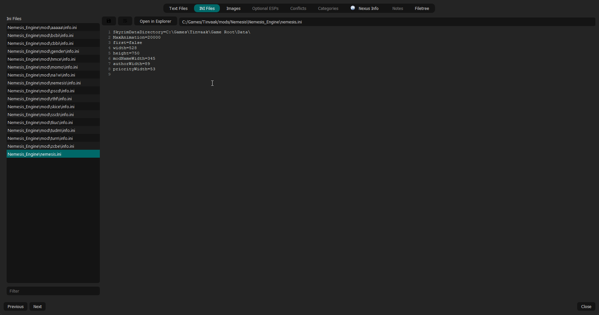
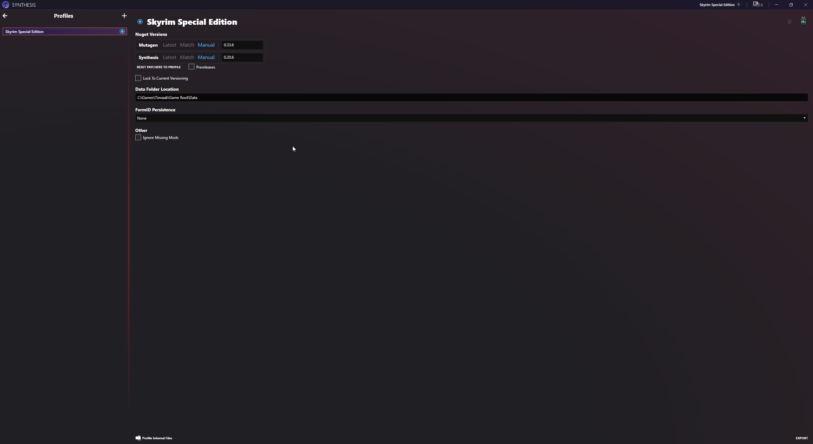
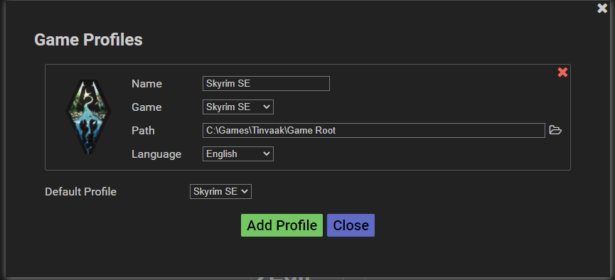
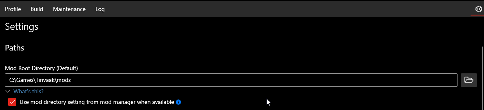
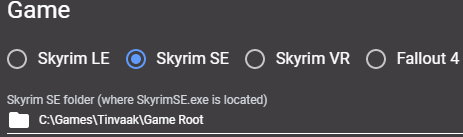
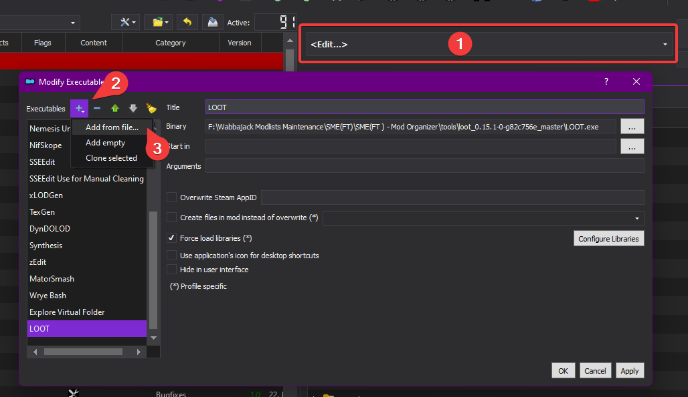

## SMEFT but Sexy Readme

You will need to read through this readme thoroughly before you get going. Setting up to install SMEFT but Sexy requires a little more effort than a standard Wabbajack modlist as there's a couple extra things to download.

### Index

- [SMEFT but Sexy Readme](#smeft-but-sexy-readme)
  - [Index](#index)
  - [Important Information](#important-information)
  - [Description](#description)
    - [What's included?](#whats-included)
  - [Installation](#installation)
    - [Required Accounts](#required-accounts)
    - [Pre-Installation](#pre-installation)
      - [Installing Microsoft Visual C++ Redistributable Package](#installing-microsoft-visual-c-redistributable-package)
      - [Installing .NET 6.0](#installing-net-60)
      - [Steam Config](#steam-config)
        - [Game Location](#game-location)
        - [Disable the Steam Overlay](#disable-the-steam-overlay)
        - [Change Steam Update Behavior](#change-steam-update-behavior)
        - [Set the Game language to English](#set-the-game-language-to-english)
      - [Clean Skyrim](#clean-skyrim)
      - [Start Skyrim](#start-skyrim)
      - [Install Creation Kit](#install-creation-kit)
  - [Using Wabbajack](#using-wabbajack)
    - [Preparation](#preparation)
    - [Downloading and Installing](#downloading-and-installing)
    - [Problems with Wabbajack](#problems-with-wabbajack)
  - [Post-installation](#post-installation)
    - [Creation Kit](#creation-kit)
    - [xEdit & xEdit based applications (DynDOLOD, xLODGen)](#xedit--xedit-based-applications-dyndolod-xlodgen)
    - [Nemesis](#nemesis)
    - [Synthesis](#synthesis)
    - [zEdit](#zedit)
    - [Easy NPC](#easy-npc)
    - [PCA SE](#pca-se)
    - [LOOT](#loot)
    - [BethINI / Visuals](#bethini--visuals)
    - [Creation Club / Anniversary Edition Upgrade Content](#creation-club--anniversary-edition-upgrade-content)
  - [How to Launch SMEFT but Sexy](#how-to-launch-smeft-but-sexy)
  - [Updating](#updating)
  - [Ultrawide Fix](#ultrawide-fix)
  - [FAQ](#faq)
    - [Are there ultrawide options available?](#are-there-ultrawide-options-available)
  - [Credits and Thanks](#credits-and-thanks)
  - [Contact](#contact)

### Important Information

Wabbajack modlists install their OWN independent instance of Mod Organizer 2. They don't work with Mod Organizer instances you installed yourself.

This list might require the latest Steam version of Skyrim SE(Special Edition)/AE(Anniversary Edition) installed, BUT it will downgrade it to version **1.5.97** due to the greater compatibility of that version with mods. You can however still use the AE included and bought via DLC Creation Club mods.

How to use the Creation Club is explained [here](https://github.com/EzioTheDeadPoet/SME-FT-/tree/SMEFT-2.0#creation-club--anniversary-edition-upgrade-content).

If you want to learn more about modding Skyrim, you can read up on it on the [/r/skyrimmods wiki](https://www.reddit.com/r/skyrimmods/wiki/begin2) or follow the [Guides by Lively](https://github.com/LivelyDismay/Learn-To-Mod/wiki) & [modding resources by The-Animonculory](https://github.com/The-Animonculory/Modding-Resources) on how to get started and with Skyrim modding.

### Description

This modlist is a utility for modders, to speed up their initial modding setup, or for people who want to play vanilla Skyrim with all the unofficial patches and fixes. It can also be utilized as a test bench for developing new mods on a stable base.

SMEFT but Sexy is built on SMEFT. Included is the OSuite of mods for the NSFW orientated stuff, body replacers for male and females as well as a basic NPC visuals overhaul for all (please let me know if I missed any!) NPCs in Skyrim. That's it! The rest is up to you and you don't even have to stick with what I've done so far!

If you want to change NPCs out, make sure to check over the NPC CR patch included out of the box - this patch merges the visual changes with the functional changes from USSEP so you may need to remove NPCs from that patch if you want to change NPC visual replacer mods.

#### What's included?

The list contains mods that fall into 2 main categories.

**Tools**
- [BethINI](http://nexusmods.com/skyrimspecialedition/mods/4875)
- [BodySlide and Outfit Studio](http://nexusmods.com/skyrimspecialedition/mods/201)
- [deorder's MO2 Plugins](https://github.com/deorder/mo2-plugins)
    - **Merge Plugins Hide:** Hide / unhide plugins that were merged using Merge Plugins or zMerge.
    - **Sync Mod Order:** Sync mod order from current profile to another while keeping the (enabled/disabled) state intact.
- [Dynamic Distant Objects LOD - DynDOLOD](https://www.nexusmods.com/skyrim/mods/59721)
    - You need to reinstall the resources with your preferences.
- [LOOT](https://github.com/loot/loot)
- [Nemesis](https://www.nexusmods.com/skyrimspecialedition/mods/60033)
    - This replaces FNIS and is compatible with any FNIS mod (even the ones with outdated descriptions demanding FNIS), with the only exception being animations involving creatures, those are incompatible. Those creature animations would not be found on the Nexus so most people wont see a difference.
- [NifSkope](https://github.com/niftools/nifskope)
- [Papyrus Compiler App (Mod Organizer 2 Integration) SE](http://nexusmods.com/skyrimspecialedition/mods/23852)
- [SSEEdit](https://nexusmods.com/skyrimspecialedition/mods/164)
- [SSELODGen](https://www.nexusmods.com/skyrimspecialedition/mods/6642)
- [Synthesis](https://github.com/Noggog/Synthesis)
- [Unofficial Mator Smash Updated](https://www.nexusmods.com/skyrimspecialedition/mods/39378)
- [Wrye Bash](https://www.nexusmods.com/skyrimspecialedition/mods/6837)
- [zEdit](https://github.com/z-edit/zedit)

**Mods**

[Load Order Library](https://loadorderlibrary.com/lists/smeft-but-sexy)

### Installation

#### Required Accounts

1. Nexus Mods - a premium account is highly recommended for automating downloads from Nexus mods.

#### Pre-Installation

These steps are only needed if you are installing this modlist for the first time.

##### Installing Microsoft Visual C++ Redistributable Package

I doubt you need to do this since you likely already have this installed. The package is required for MO2 and you can download it from Microsoft. Download the x64 version under "Visual Studio 2015, 2017 and 2019".

[Direct link](https://aka.ms/vs/16/release/vc_redist.x64.exe)

##### Installing .NET 6.0

This is a needed dependency for mods used with this list. So please make sure to install it to avoid any issues. Download the desktop app x64 AND the console app x64 versions from Microsoft.

- [Direct Link Desktop](https://dotnet.microsoft.com/en-us/download/dotnet/thank-you/runtime-desktop-6.0.5-windows-x64-installer)
- [Direct Link Console](https://dotnet.microsoft.com/en-us/download/dotnet/thank-you/runtime-6.0.5-windows-x64-installer)

##### Steam Config

###### Game Location

Make sure your game is NOT installed in a common folder like your Desktop, Downloads or Program Files folder (like the default steam location). If you only have one drive and can't create a second steam library with steam use LostDragonist's steam-library-setup-tool to create a second one on your main drive. When you have a new steam library setup move your game there using the steam feature to do so.

*Creating a new library with Steam:*

*Moving the game:*

###### Disable the Steam Overlay

The Steam Overlay can cause issues with ENB and is recommended to be turned off when using and ENB, this list only uses ReShade which makes this step only necessary if you want to add an ENB yourself.

Open the Properties window (right-click the game in your Library->Properties), navigate to the General tab, and un-tick the Enable the Steam Overlay while in-game checkbox.

###### Change Steam Update Behavior

SSE is still being updated by Bethesda (they only add Creation Club content). Whenever the game updates, the entire modding community goes silent for the next one or two weeks because some mods need to be updated to the latest game runtime version.

To ensure that Steam does not automatically update the game for you, head over to the Properties window, navigate to the Updates tab and change Automatic updates to Only update this game when I launch it. You should also disable the Steam Cloud while you're at it.

###### Set the Game language to English

This entire modlist is in English and 99% of all mods you will find are also in English. I highly recommend playing the game in English and *I can not give support to people with a non-English game.*

Open the Steam Properties window, navigate to the Language tab and select English from the dropdown menu.

##### Clean Skyrim

I highly recommend uninstalling the game through Steam, deleting the game folder, and reinstalling it. You should also clean up the Skyrim Special Edition folder in `Documents/My Games/` by deleting the contents in it. But verifying your installation via Steam should be enough, if the installation fails follow the steps above.

How to verify Skyrim Special Edition with Steam:

- Open your Steam Library tab
- Right-click Skyrim Special Edition
- Select Properties
- Select Local Files
- Select Verify Integrity of Local Files

##### Start Skyrim

After you have done everything above and you have a clean Skyrim Special Edition installation, start the Launcher and let it do the initial graphics check. Do not worry about this part as the installation will replace these graphics settings. Start the game and exit once you're on the main menu.

##### Install Creation Kit

Install the Creation kit from Steam into the same library you have Skyrim Special Edition installed in. (Don't forget to use the same location you chose in the Game Location section.)

### Using Wabbajack

#### Preparation

Grab the latest release of Wabbajack from [here](https://www.wabbajack.org/#/) and place the `Wabbajack.exe` file in a working folder. This folder must not be in a common folders like your *Desktop, Downloads or Program Files* folder. It's best to create a Wabbajack folder near the root level of your drive, such as `C:/Wabbajack`.

#### Downloading and Installing

The download and installation process can take a very long time depending on your system specs. Wabbajack will detect the optimal amount of threads at the beginning of the installation. To have the highest amount of threads and thus the fastest speed, it is advised to have the working folder on an SSD.

1. Select a folder for all the mods that need to be downloaded somewhere that is not affected by UAC (Please do not put it in Documents, Program Files, Desktop. Put it somewhere easy like C:/Modlists/SME(FT)/downloads(Replace "SME(FT)" with the name of a list you might want to create for Wabbajack) or Modlists/Downloads).
2. Open Wabbajack
3. Click on the settings icon and log in with your Nexus Mods Account.
4. Click on Browse Modlists, enable Only Utility Lists, and download SME(FT) from the gallery.
5. Once the download is done set the Installation folder to somewhere that is not affected by UAC (Please do not put it in Documents, Program Files, Desktop. Put it somewhere easy like C:/Modlists/SME(FT)(Replace "SME(FT)" with the name of a list you might want to create for Wabbajack)). The downloads path should be the one you created in step 1.
6. Click the Go/Begin button
7. Wait for Wabbajack to finish
8. [Post-Installation](#post-installation)

#### Problems with Wabbajack

There are a lot of different scenarios where Wabbajack will produce an error. I recommend re-running Wabbajack before posting anything. Wabbajack will continue where it left off so you lose no progress.

**Could not download x:**
If a mod got updated and the old files got deleted, it is impossible to download them. In this case, just wait till I update the modlist.

**x is not a whitelisted download:**
This can happen when I update the modlist. Check if a new update is available and wait if there is none.

**Wabbajack could not find my game folder:**
Wabbajack will not work with a pirated version of the game. If you own the game on Steam, go back to the Pre-Installation step. If you own the game make sure you did start Skyrim once.

**Windows is reporting that a virus has been detected:**
Windows 10 has started to auto-quarantine the usvfs_proxy_x86.exe file from the latest version of Mod Organizer 2 saying a threat was detected. This is a known false positive confirmed by the MO2 Devs. You can fix this by adding an exemption for MO2 Folder to your Antivirus. An example for windows defender can be found here.

### Post-installation

#### Creation Kit
Already set up out of the box.

#### xEdit & xEdit based applications (DynDOLOD, xLODGen)
xEdit, xLODGen already configured.

DynDOLOD requires you to reinstall `DynDOLOD Resources SE`, this is because it comes with a FOMOD that depends on your personal end goals with DynDOLOD. The shortcuts are already configured. Just right-click the mod and select `Reinstall Mod`.

This list installs the "stable" older 2.0 version of DynDOLOD.
You can replace it with the 3.0 alpha builds but maintaining those frequent updates would be too much of a hassle.

#### Nemesis
For Nemesis to work with Stock Game, you need to adjust one of the lines in the Nemesis ini. To do this, complete the following steps.

1. Open the Nemesis (double click it in the Modder resources section) mod and go to the INI Files tab.
2. Select Nemesis.ini
3. In the SkyrimDataDirectory line, change auto to the location of your data directory. ({list install location}\Skyrim Special Edition\Data)
4. Save the ini file.

The picture below shows how the ini file should look (The path listed in the image is an EXAMPLE).

#### Synthesis
Synthesis is relatively simple to configure for Stock Game. Like Nemesis, you just need to tell it where your game data folder is. To configure Synthesis, complete the following steps.

1. Run Synthesis and select the game you are using (in my case Skyrim Special Edition)
2. Click on the Skyrim Special Edition text in the top right corner.
3. In the data folder location field, add where your stock game is. It should look like the picture below.
4. Synthesis will auto-save this data and remember it for future times you run it.

#### zEdit
zEdit is again a relatively simple tool to configure for Stock Game. Like the previous two tools, you just need to tell it where your game data folder is. To configure zEdit, complete the following steps.

1. Run zEdit and select the tool you want. Do not run any tool yet
2. Press the settings cog to open the game profiles configuration.
3. Change the Path field to where your stock game is. It should look like the picture below. alt text
4. Run the application to ensure that it picks up your data folder.

#### Easy NPC
EasyNPC does not require any special setup other than simply making sure the checkbox marked `Use mod directory setting from mod manager when available` is checked.

#### PCA SE
PCA SE does not require any special setup other than telling it where the game is.

#### LOOT
I will start with this: LOOT is a tool and a "dumb" one at that as in it can't scan for what is inside your mods and can only scratch the surface of meta data which is not enough to actually properly know which mods need patches or need to be ordered differently, all this information is stored in a static community maintained database file called the masterlist, and as you might be able to guess a masterlist like this simply can't always be correct nor will it be able to properly detect updated mods or mods you altered.

There are ways LOOT can be useful, but for me personally none of those are worth the effort I would have to put into maintaining custom sorting rules and the likes.

If you want to use LOOT link it to the Mod Organizer 2 instance like shown here:

And in the LOOT settings after starting it make sure to set the `Install Path` to the `Skyrim Special Edition` folder inside of the SMEFT but Sexy modlist installation folder:

#### BethINI / Visuals
After the installation is finished, go to your installation directory, proceed into the `tools\BethINI` folder. Make sure Mod Organizer 2 and Skyrim are closed and start `BethINI.exe`. Select Skyrim Special Edition in the drop-down menu and proceed after reading the warning. Go to the Setup tab on the far-left of BethINI and select `Browse...` in the Mod Organizer drop-down menu. Browse to your installation folder and select `ModOrganizer.exe` inside. Now select the SMEFT but Sexy profile in the Profiles drop-down menu, below the Mod Organizer label. Click Yes if BethINI asks whether it may modify custom INI files.

Go back to the Basic tab, check the box next to `Recommended Tweaks` and select the preset you think is right for your PC. Modern PCs should be fine with the Medium or High preset. People with high end PCs - I would recommend against the Ultra preset even with your RTX 3090 and Ryzen 9 5950X, unless you're going for a screen archery setup. The lost performance is better spent upping the settings quality of your favorite ENB preset. Click `Save and Exit` after you've applied the settings.

#### Creation Club / Anniversary Edition Upgrade Content
Use [Anniversary Edition Content Picker](https://www.nexusmods.com/skyrimspecialedition/mods/58890) to install the Anniversary Edition Upgrade Creation Club Content

[Guide made by the author of the content picker is here.](https://www.youtube-nocookie.com/embed/63vss_VlPnc)

### How to Launch SMEFT but Sexy
Head over to the installation folder (*the place you choose to install the modlist to*) and locate the `ModOrganizer.exe`, double click launch it. Once it's launched there will be a dropdown box on the top right and a big run button next to it. Ensure it is set to SKSE by selecting it in the dropdown box and then hitting the run button. Under the run button, you can find a shortcut menu that allows you to make a desktop shortcut.

If the game doesn't launch correctly check [this](#problems-with-wabbajack) and the [pre-installation steps](#pre-installation) as those are the solutions for the most common issues besides an failed installation.

### Updating
You should not update SMEFT but Sexy as it will delete all your modding you did on top of it.

**Wabbajack will delete all files that are not part of the modlist when updating!**

### Ultrawide Fix
*These are things I was recommended that I can not test since I don't own an ultrawide monitor.*

[Complete Widescreen Fix](https://www.nexusmods.com/skyrimspecialedition/mods/1778) contains the necessary mods for ultrawide monitor users. Download and install these mods using Mod Organizer 2. The first file is found under the Main Files section of the mod files page, the rest are under Optional Files.

- Complete Widescreen Fix for SkyUI 5.2 SE Alpha - 2560x1080
    - Place this mod under SkyUi and keep both active (Patch)
- Better Dialogue Control Widescreen Fix
    - Disable Better Dialogue Control and place this mod under it (Replacer)
- Better MessageBox Control Widescreen Fix
    - Disable Better MessageBox Control and place this mod under it (Replacer)
- SkyUI SE - Flashing Savegames Fix[sic] - Widescreen Fix
    - Disable Flashing Savegames Fix and place this mod under it (Replacer)
- Race Menu SE - Widescreen Fix (Optional Files)
    - Place this mod under RaceMenu and keep both active (Patch)
    - 
Alternatively, an easier option that will result in a less vanilla-looking UI is [Dear Diary](https://www.nexusmods.com/skyrimspecialedition/mods/23010). It includes support for 21:9 and 32:9.

### FAQ

#### Are there ultrawide options available?
Not included by default, but there are the instructions in the Ultrawide Fixes Section.

### Credits and Thanks
- You, for actually reading the entirety of the README
- LucaEzioTheDeadPoet for making SMEFT which this modlist is based on
- Halgari and everyone on the Wabbajack team
- All the mod authors that made the mods featured in this list

### Contact
Please don't bother Luca about support for SMEFT but Sexy and instead join the Jolly Co-operators Discord server from here: https://discord.gg/jolly-coop

Make sure to grab the Unofficial and WIP modlists role from the #welcome channel and ask around in #unofficial-support. Do not DM me for help, I will ignore you!